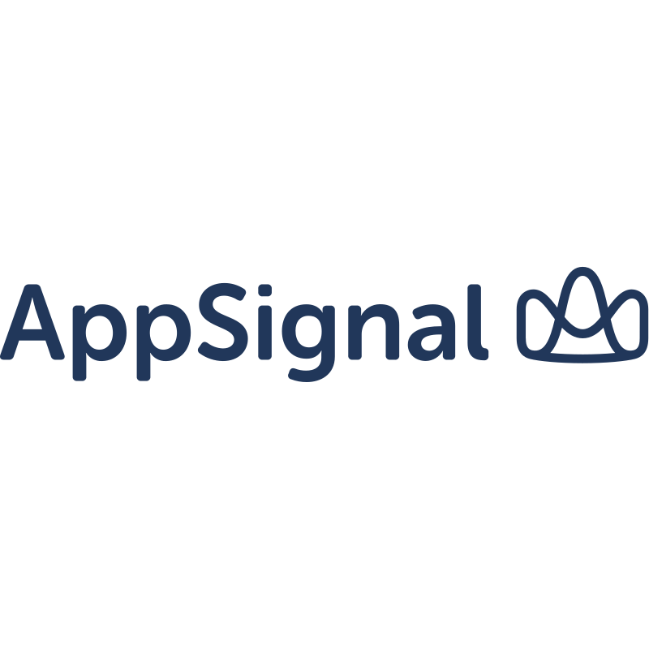

    

> impactMarket leverages Web3 to provide accessible financial solutions, including Unconditional Basic Income, the crypto wallet Libera, Microcredit, and Learn and Earn, empowering financially unserved and underserved people around the world.

## Getting started

Use the package manager [yarn](https://yarnpkg.com/) to install dependencies.

### Run API

1. Config .env
2. Install dependencies (`yarn` at root folder)
3. `docker compose up` (you will need docker)
4. From the root folder, run sequelize migrations with `NODE_ENV=test API_ENVIRONMENT=development ./release-tasks.sh` (Using `NODE_ENV=test` avoid running updates the first time, potentially causing breaks)
5. `yarn dev`

### Run Test

1. Config .env.test in each folder
2. From root run `yarn test`

See [PERFORMANCE.md](./PERFORMANCE.md) to learn more about load tests.

## Thank you

A really big thank you to [AppSignal](https://appsignal.com/) for sponsoring us. AppSignal is "No-brainer monitoring for smart developers."

## Troubleshooting

#### lipq node-gyp issue - ValueError: invalid mode: 'rU' while trying to load binding.gyp
See https://github.com/nodejs/node-gyp/issues/2219#issuecomment-1359160362

## License

[Apache-2.0](LICENSE)
